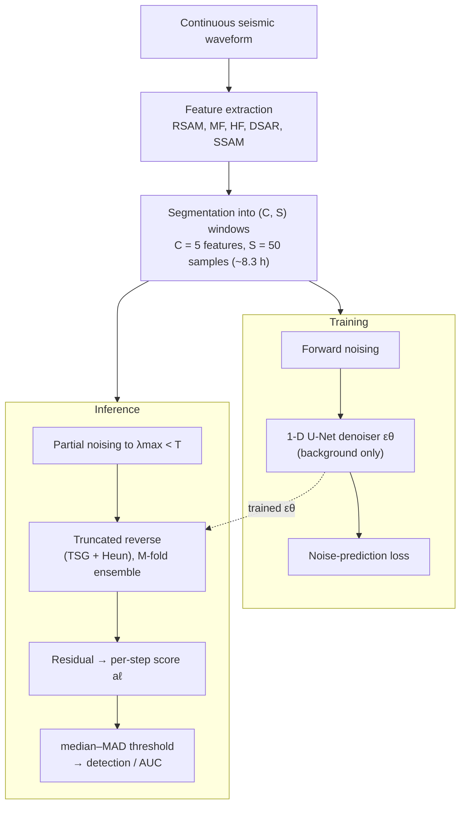

# Volcanic Activity Detection and Forecasting Using a Diffusion Based Model

Reference implementation for the paper:

> **Volcanic Activity Detection and Forecasting Using a Diffusion Based Model**
> Syed Faisal Ishtiaq, W. Bastiaan Kleijn, Paul D. Teal.
> *Applied Computing and Geosciences* (Elsevier), 2026.
> DOI: [10.1016/j.acags.2026.100385](https://doi.org/10.1016/j.acags.2026.100385)

[](LICENSE)
[](https://doi.org/10.1016/j.acags.2026.100385)

An **unsupervised** denoising-diffusion model (DDPM) that flags volcanic events as
deviations from normal seismic-tremor behaviour. The model is trained only on
non-eruptive tremor, and anomalies are scored from reconstruction residuals. No
eruption labels are used during training; labels are used only to *evaluate*
forecasting skill.

This repository contains the **training, testing, and evaluation** code plus the
key **result tables**. Plotting / figure-generation code is intentionally left out
of this release. Large model weights and the raw seismic data are **not** shipped
(see [Data](#data) and [Model weights](#model-weights)).

## Method overview

End-to-end framework (Fig. 1 in the paper): continuous seismic waveforms are reduced
to five tremor features and split into `(C, S)` segments; the denoiser is trained on
background segments only, and at inference each segment is partially noised, denoised
with Time-Step Guidance + Heun, ensemble-averaged, and turned into a residual-based
anomaly score that is thresholded for detection and scored by full-record AUC.



---

## Method in brief

- **Backbone:** 1-D U-Net denoiser `epsilon_theta(x_t, t)` trained with the standard
  DDPM noise-prediction (MSE) objective.
- **Partial-noise reverse process:** inference starts from a *partially* noised state
  `x_{lambda_max}` (`lambda_max < T`) instead of pure Gaussian noise, so structure of
  the input is retained for reconstruction-based scoring.
- **Time-Step Guidance (TSG):** an internal guidance signal formed by perturbing the
  time-step embedding (no external classifier/condition required); strength
  `w_TSG`.
- **Heun 2nd-order ODE solver:** deterministic probability-flow sampling for sharper,
  more stable reconstructions.
- **Ensemble:** `M` reverse passes are averaged.
- **Anomaly score:** per-time-step sum of squared per-channel residuals between input
  and reconstruction. Because it is an exact sum over channels, it decomposes into
  per-channel contributions (used for the per-channel decomposition analysis).
- **Thresholding:** trimmed median–MAD rule (drop top 1% for estimation, cap at the
  99th percentile), threshold applied to the full score series.

**Paper hyperparameters:** features `C = 5` (RSAM, MF, HF, DSAR, SSAM) at 10-min
cadence; segment length `S = 50` (~8.3 h); diffusion steps `T = 1000`;
`lambda_max = 500`; `w_TSG = 3.5`; ensemble `M = 5`. (Config is set inside the entry
scripts — see [Usage](#usage).)

---

## Repository layout

```
.
├── README.md
├── LICENSE                     # MIT
├── CITATION.cff
├── requirements.txt
├── pyproject.toml              # `pip install -e .` exposes the `cfg_ddim` package
├── docs/
│   └── PIPELINE.md             # module-by-module walkthrough + data flow
├── src/cfg_ddim/               # the model + training/testing/evaluation package
│   ├── __init__.py             # DenoiseDiffusion: forward/reverse, TSG, Heun ODE
│   ├── unet.py                 # 1-D U-Net denoiser
│   ├── utils.py                # gather() helper
│   ├── experiment_cfg_ddim.py  # labml Configs, Dataset, training loop
│   ├── training_model_cfg_ddim.py   # >>> training entry point
│   ├── evaluate_cgf_ddim_tremor.py  # >>> volcano evaluation (anomaly score + AUC)
│   ├── evaluate_cgf_ddim.py         # >>> benchmark multivariate-AD evaluation
│   ├── testing.py                   # standalone reconstruction/score testing
│   ├── metrics.py              # F1_K-AUC, ROC_K-AUC, PA%K protocol
│   ├── perchannel_decomposition.py  # per-channel anomaly decomposition (paper Fig. D1)
│   └── anticipation_analysis.py     # eruption-anticipation counts at a fixed operating point
├── notebooks/
│   ├── DDPM_forecasting_evaluation_GPU.ipynb   # forecasting-skill AUC (Ardid protocol)
│   └── _build_eval_gpu_nb.py                    # script that generates the notebook
├── results/                    # lightweight result tables from the paper
│   ├── forecasting_auc/        # full-record + 48h AUC, DDPM vs SAE vs Ardid
│   ├── ablations/              # ensemble-size and lambda_max sweeps
│   ├── benchmark/              # synthetic-benchmark ROC across K
│   ├── perchannel/             # per-channel score shares (Fig. D1 numbers)
│   └── compute/                # inference-time measurements
└── reference/
    └── eruptive_periods.txt    # eruption onset timestamps used for evaluation
```

---

## Installation

```bash
# Python 3.9–3.11 recommended
python -m venv .venv && source .venv/bin/activate     # or conda create -n ddpm python=3.10
pip install -r requirements.txt
pip install -e .        # makes `import cfg_ddim` work from anywhere
```

A CUDA-capable GPU is strongly recommended for training and for volcano-scale
evaluation (multi-year records = thousands of segments).

---

## Data

The raw seismic data is **not** included (multi-GB, and redistributable only from the
original providers). Reproduce the feature files from public archives:

- **Whakaari (White Island)** — GeoNet station **WIZ**.
- **Ruapehu** — GeoNet station **FWVZ**. <https://www.geonet.org.nz/>
- **Pavlof, Alaska** — AVO network station **PVV**, via IRIS web services.
  <https://www.avo.alaska.edu/>

**Features (`C = 5`)**, 10-minute cadence, instrument-response corrected, each
normalised to `[-1, 1]`:

| Feature | Definition |
|---------|-----------|
| RSAM | 10-min mean abs vertical velocity, band-pass 2–5 Hz |
| MF   | as RSAM, band-pass 4.5–8 Hz |
| HF   | as RSAM, band-pass 8–16 Hz |
| DSAR | MF/HF of displacement (integrate velocity), 10-min abs mean |
| SSAM | cosine-tapered 10-min spectral energy |

**Expected layout** (paths are relative in the entry scripts; edit them to match your
setup):

```
./cfg/data/raw/<Volcano>_..._features.csv     # test / full-record feature series
./cfg/data/raw/<Volcano>_..._clean.csv        # training data = non-eruptive segments only
./data_external/...                            # benchmark datasets (SWaT, WaDi, synthetic)
```

`reference/eruptive_periods.txt` lists the eruption onsets used to build evaluation
labels (format: `YYYY MM DD HH MM SS`).

---

## Model weights

Trained weights are **not** distributed (~1 GB each). Train your own with the
training entry point below; checkpoints are written to
`./cfg/src/cfg_ddim/model_weights/`. Evaluation scripts load a checkpoint by its
experiment tag (e.g. `exp = "27_Tremor"` for the Whakaari model in the paper).

---

## Usage

> Configuration is set **inside** each entry script (they use the `labml` config
> system, not command-line flags). Open the script, edit the config block near the
> bottom (`exp`, `dataset`, `dataset_path`, `lambda_max`, `guidance_scale`, …), then
> run it.

### 1. Train

```bash
python src/cfg_ddim/training_model_cfg_ddim.py
```

Edit the config block: choose `dataset = 'Tremor'`, point `dataset_path` at the
**clean (non-eruptive)** feature CSV, set `image_channels = 5`, `chunk_size = 50`,
`lambda_max`, `guidance_scale`, and a unique `exp` tag. The checkpoint path is
derived from `exp`.

### 2. Volcano evaluation (anomaly score + forecasting AUC)

```bash
python src/cfg_ddim/evaluate_cgf_ddim_tremor.py
```

In `main()` select the volcano (sets `exp`, `test_path`, `w_TSG`, date window). The
script reconstructs each segment, computes the per-time-step anomaly score, applies
the median–MAD threshold, and reports detection/AUC. Per-segment MSE arrays are
cached under `./cfg/results/mse_analysis/`.

### 3. Benchmark multivariate-AD evaluation

```bash
python src/cfg_ddim/evaluate_cgf_ddim.py
```

Runs the SWaT / WaDi / synthetic benchmarks and reports `F1_K-AUC` and `ROC_K-AUC`
(see `metrics.py`) using the same protocol as the baselines in the paper.

### 4. Forecasting-skill AUC (Ardid-2025 protocol)

Open `notebooks/DDPM_forecasting_evaluation_GPU.ipynb`. It computes the full-record
ROC AUC with: 48-hour pre-eruptive positive window, ±30-day exclusion buffer around
eruptions, a single fixed 48-hour causal-median smoothing, and AUC over the whole
record (≈300:1 class imbalance). No eruption labels enter the model; they are used
only to score AUC (pseudo-prospective). `_build_eval_gpu_nb.py` regenerates the
notebook.

---

## Results (included tables)

| File | Contents |
|------|----------|
| `results/forecasting_auc/FINAL_auc_full_record.csv` | Full-record AUC (raw, 48 h, best-smoothed) per volcano, vs SAE and Ardid supervised |
| `results/forecasting_auc/auc_table_DDPM_vs_SAE_vs_Ardid.csv` | Headline AUC comparison table |
| `results/ablations/ensemble_variation.csv` | AUC / score vs ensemble size `M` |
| `results/ablations/ddpm_lambda_sweep.csv` | Effect of `lambda_max` |
| `results/benchmark/v_synth_roc_all_Ks.csv` | Synthetic-benchmark ROC across K |
| `results/perchannel/perchannel_shares.csv` | Per-channel score share, in-event vs background |
| `results/compute/inference_time_DDPM.csv` | Per-segment / per-48 h inference time (GPU) |

Headline forecasting AUC (full record): Whakaari **0.86**, Ruapehu **0.88**,
Pavlof **~0.58** — matching the supervised state of the art on the phreatic systems
without using eruption labels.

---

## Notes and caveats

- The entry scripts carry commented-out alternative dataset paths from development;
  the active path is the uncommented one in each config block — edit for your data.
- Plotting / figure code (Fig. 2, Fig. D1, ROC figures) is **not** part of this
  release.
- Lead times reported in the paper are descriptive of retrospective case studies, not
  operational warning-time guarantees. Forecasting *skill* is the threshold-free AUC.

See [`docs/PIPELINE.md`](docs/PIPELINE.md) for a module-by-module walkthrough.

---

## Citation

See [`CITATION.cff`](CITATION.cff). Please cite the paper if you use this code.

## License

MIT — see [`LICENSE`](LICENSE).
