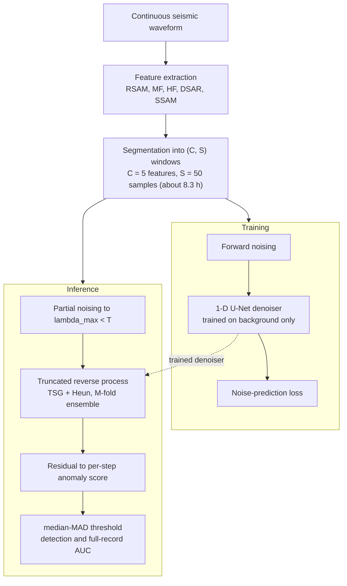

# Volcanic Activity Detection and Forecasting Using a Diffusion Based Model

[](LICENSE)
[](https://doi.org/10.1016/j.acags.2026.100385)

Reference implementation for the paper:

> **Volcanic Activity Detection and Forecasting Using a Diffusion Based Model**
> Syed Faisal Ishtiaq, W. Bastiaan Kleijn, Paul D. Teal.
> *Applied Computing and Geosciences* (Elsevier), 2026.
> DOI: [10.1016/j.acags.2026.100385](https://doi.org/10.1016/j.acags.2026.100385)

This is an unsupervised denoising diffusion probabilistic model (DDPM) that detects volcanic events as deviations from normal seismic tremor. The model is trained only on non-eruptive tremor and scores anomalies from reconstruction residuals. Eruption labels are never used during training. They are used only to evaluate forecasting skill.

The repository provides the model, the training code, the testing and evaluation code, and the key result tables from the paper. Figure-generation code is not included in this release. The trained model weights and the raw seismic data are not shipped, for the reasons given in [Data](#data) and [Model weights](#model-weights).

## Method

The framework maps a continuous seismic record to five tremor features, splits the record into fixed-length segments, learns to reconstruct normal segments, and scores each timestep by how poorly it is reconstructed. Figure 1 of the paper summarises the pipeline:



Components:

- **Backbone.** A 1-D U-Net denoiser, written `epsilon_theta(x_t, t)`, trained with the standard DDPM noise-prediction (MSE) objective.
- **Partial-noise reverse process.** Inference starts from a partially noised state `x_{lambda_max}` with `lambda_max < T`, rather than from pure Gaussian noise, so the structure of the input is retained for reconstruction-based scoring.
- **Time-Step Guidance (TSG).** An internal guidance signal formed by perturbing the time-step embedding, with strength `w_TSG`. It needs no external classifier or condition.
- **Heun second-order ODE solver.** Deterministic probability-flow sampling for sharper and more stable reconstructions.
- **Ensemble.** `M` reverse passes are averaged to reduce sampling variance.
- **Anomaly score.** The per-timestep sum of squared per-channel residuals between input and reconstruction. Because it is an exact sum over channels, it decomposes into per-channel contributions, which drive the per-channel decomposition analysis.
- **Thresholding.** A trimmed median-MAD rule: the top 1 percent of scores are dropped for estimation and capped at the 99th percentile, and the resulting threshold is applied to the full score series.

Paper hyperparameters: five features (RSAM, MF, HF, DSAR, SSAM) at 10-minute cadence; segment length `S = 50` (about 8.3 h); diffusion steps `T = 1000`; `lambda_max = 500`; `w_TSG = 3.5`; ensemble `M = 5`. Each value is set inside the entry scripts, as described in [Usage](#usage).

## Repository layout

```
.
├── README.md
├── LICENSE                     # MIT
├── CITATION.cff
├── requirements.txt
├── pyproject.toml              # pip install -e . exposes the cfg_ddim package
├── docs/
│   └── PIPELINE.md             # module-by-module walkthrough and data flow
├── src/cfg_ddim/               # model, training, testing, and evaluation package
│   ├── __init__.py             # DenoiseDiffusion: forward, reverse, TSG, Heun ODE, loss
│   ├── unet.py                 # 1-D U-Net denoiser
│   ├── utils.py                # gather() helper
│   ├── experiment_cfg_ddim.py  # labml Configs, dataset, training loop
│   ├── training_model_cfg_ddim.py    # training entry point
│   ├── evaluate_cgf_ddim_tremor.py   # volcano evaluation (anomaly score and AUC)
│   ├── evaluate_cgf_ddim.py          # benchmark multivariate anomaly-detection evaluation
│   ├── testing.py                    # standalone reconstruction and scoring
│   ├── metrics.py              # F1-K-AUC, ROC-K-AUC, PA%K protocol
│   ├── perchannel_decomposition.py   # per-channel anomaly decomposition (paper Fig. D1)
│   └── anticipation_analysis.py      # eruption-anticipation counts at a fixed operating point
├── notebooks/
│   ├── DDPM_forecasting_evaluation_GPU.ipynb   # forecasting-skill AUC (Ardid protocol)
│   └── _build_eval_gpu_nb.py                    # regenerates the notebook
├── results/                    # lightweight result tables from the paper
│   ├── forecasting_auc/        # full-record and 48 h AUC, DDPM vs SAE vs Ardid
│   ├── ablations/              # ensemble-size and lambda_max sweeps
│   ├── benchmark/              # synthetic-benchmark ROC across K
│   ├── perchannel/             # per-channel score shares (Fig. D1 numbers)
│   └── compute/                # inference-time measurements
└── reference/
    └── eruptive_periods.txt    # eruption onset timestamps used for evaluation
```

## Installation

The code targets Python 3.9 to 3.11 and PyTorch. It is device agnostic and runs on CPU, CUDA, or Apple MPS.

```bash
python -m venv .venv && source .venv/bin/activate     # or: conda create -n ddpm python=3.10
pip install -r requirements.txt
pip install -e .                                        # exposes the cfg_ddim package
```

A CUDA GPU is recommended for training and for volcano-scale evaluation, where a multi-year record contains thousands of segments.

## Data

The raw seismic data is not included. It is large and is redistributable only from the original providers. Rebuild the feature files from the public archives below.

- Whakaari (White Island): GeoNet station WIZ, <https://www.geonet.org.nz/>.
- Ruapehu: GeoNet station FWVZ, <https://www.geonet.org.nz/>.
- Pavlof, Alaska: Alaska Volcano Observatory network station PVV via IRIS web services, <https://www.avo.alaska.edu/>.

The five features are computed at 10-minute cadence, corrected for instrument response, and normalised to the range [-1, 1].

| Feature | Definition |
|---------|-----------|
| RSAM | 10-minute average of absolute vertical velocity, band-pass 2 to 5 Hz |
| MF | as RSAM, band-pass 4.5 to 8 Hz |
| HF | as RSAM, band-pass 8 to 16 Hz |
| DSAR | ratio of MF to HF of displacement (integrate velocity), 10-minute absolute mean |
| SSAM | cosine-tapered 10-minute spectral energy |

The entry scripts use relative paths, which you edit to match your setup:

```
./cfg/data/raw/<Volcano>_..._features.csv   # test or full-record feature series
./cfg/data/raw/<Volcano>_..._clean.csv      # training data: non-eruptive segments only
./data_external/...                          # benchmark datasets (SWaT, WaDi, synthetic)
```

The file `reference/eruptive_periods.txt` lists the eruption onsets used to build evaluation labels, in the format `YYYY MM DD HH MM SS`.

## Model weights

Trained checkpoints are not distributed, as each is about 1 GB. Train your own with the training entry point below. Checkpoints are written to `./cfg/src/cfg_ddim/model_weights/`, and the evaluation scripts load a checkpoint by its experiment tag (for example `exp = "27_Tremor"` for the Whakaari model in the paper).

## Usage

Configuration is set inside each entry script through the `labml` config system, not through command-line flags. Open the script, edit the config block near the bottom (`exp`, `dataset`, `dataset_path`, `lambda_max`, `guidance_scale`, and related fields), then run it. A fixed random seed is set for reproducibility.

### 1. Train

```bash
python src/cfg_ddim/training_model_cfg_ddim.py
```

Set `dataset = "Tremor"`, point `dataset_path` at the clean, non-eruptive feature CSV, and set `image_channels = 5`, `chunk_size = 50`, `lambda_max`, `guidance_scale`, and a unique `exp` tag. The checkpoint path is derived from `exp`.

### 2. Volcano evaluation (anomaly score and forecasting AUC)

```bash
python src/cfg_ddim/evaluate_cgf_ddim_tremor.py
```

In `main()`, select the volcano, which sets `exp`, `test_path`, `w_TSG`, and the date window. The script reconstructs each segment, computes the per-timestep anomaly score, applies the median-MAD threshold, and reports the detections and the AUC. Per-segment residual arrays are cached under `./cfg/results/mse_analysis/`, so scoring can be repeated without a new GPU pass.

### 3. Benchmark evaluation

```bash
python src/cfg_ddim/evaluate_cgf_ddim.py
```

Runs the SWaT, WaDi, and synthetic benchmarks and reports F1-K-AUC and ROC-K-AUC (see `metrics.py`) under the same protocol as the baselines in the paper.

### 4. Forecasting-skill AUC (Ardid protocol)

Open `notebooks/DDPM_forecasting_evaluation_GPU.ipynb`. It computes the full-record ROC AUC with a 48-hour pre-eruptive positive window, a plus-or-minus 30-day exclusion buffer around eruptions, a single fixed 48-hour causal-median smoothing, and the AUC taken over the whole record, where non-eruptive samples outnumber pre-eruptive ones by about 300 to 1. No eruption labels enter the model; they are used only to score the AUC, which makes the evaluation pseudo-prospective. The script `_build_eval_gpu_nb.py` regenerates the notebook.

## Results

The tables below are included under `results/`.

| File | Contents |
|------|----------|
| `results/forecasting_auc/FINAL_auc_full_record.csv` | Full-record AUC (raw, 48 h, best-smoothed) per volcano, against SAE and the Ardid supervised baseline |
| `results/forecasting_auc/auc_table_DDPM_vs_SAE_vs_Ardid.csv` | Headline AUC comparison table |
| `results/ablations/ensemble_variation.csv` | AUC and score against ensemble size M |
| `results/ablations/ddpm_lambda_sweep.csv` | Effect of lambda_max |
| `results/benchmark/v_synth_roc_all_Ks.csv` | Synthetic-benchmark ROC across K |
| `results/perchannel/perchannel_shares.csv` | Per-channel score share, in-event against background |
| `results/compute/inference_time_DDPM.csv` | Per-segment and per-48 h inference time on GPU |

Headline forecasting AUC over the full record is 0.86 for Whakaari, 0.88 for Ruapehu, and about 0.58 for Pavlof. On the phreatic systems (Whakaari and Ruapehu) this matches the supervised state of the art, without using any eruption labels.

## Notes

- Each entry script keeps commented-out alternative dataset paths from development. The active path is the single uncommented line in the config block; edit it for your data.
- Figure-generation code (Fig. 2, Fig. D1, and the ROC figures) is not part of this release.
- The lead times reported in the paper describe the retrospective case studies. They are not operational warning-time guarantees. Forecasting skill is the threshold-free AUC.

See [docs/PIPELINE.md](docs/PIPELINE.md) for a module-by-module walkthrough.

## Citation

If you use this code, please cite the paper. Machine-readable metadata is in [CITATION.cff](CITATION.cff).

```bibtex
@article{ishtiaq2026volcanic,
  title   = {Volcanic Activity Detection and Forecasting Using a Diffusion Based Model},
  author  = {Ishtiaq, Syed Faisal and Kleijn, W. Bastiaan and Teal, Paul D.},
  journal = {Applied Computing and Geosciences},
  year    = {2026},
  doi     = {10.1016/j.acags.2026.100385}
}
```

## License

Released under the MIT License. See [LICENSE](LICENSE).
